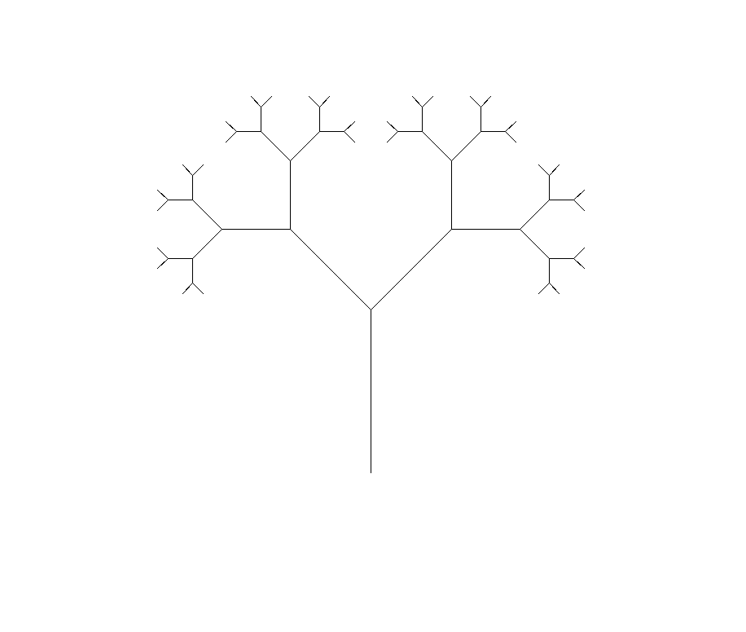
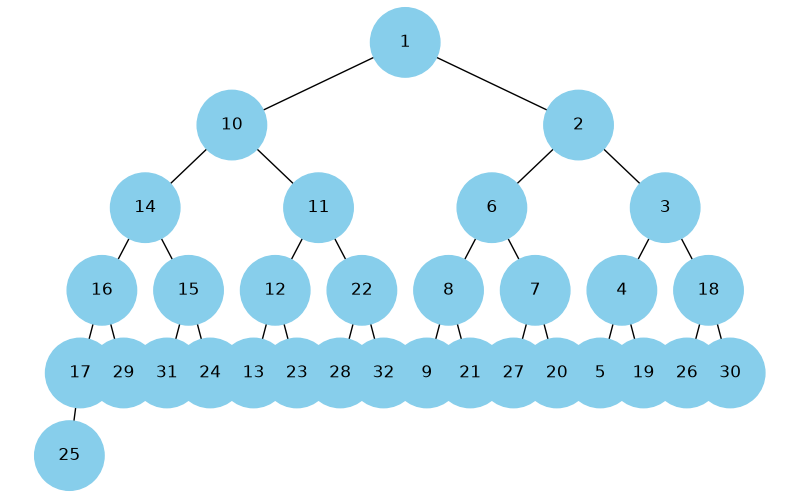
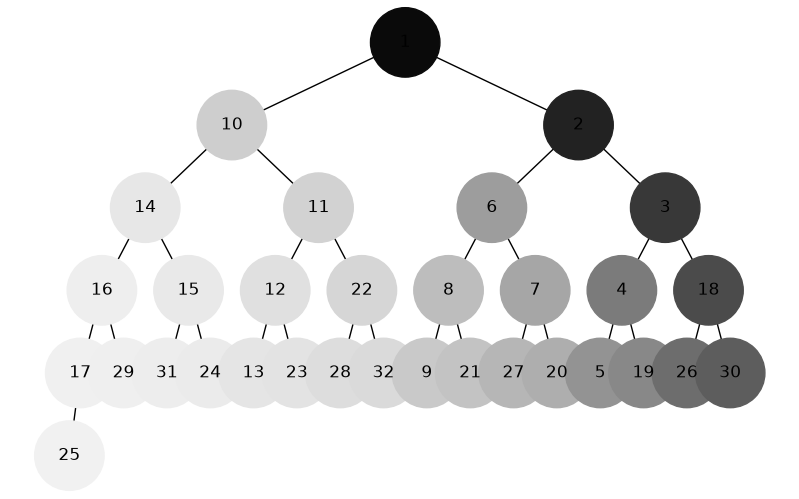
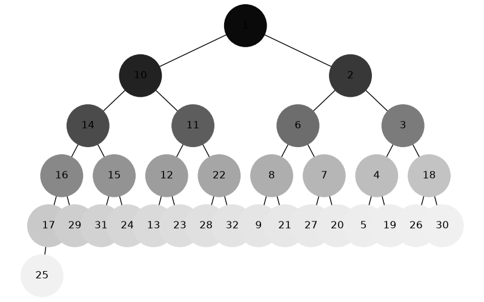

# Фінальний проєкт (Algorithms)

## Завдання 1. Однозв'язний список

Реверс, сортування, об'єднання двох відсортованих списків.

Файл: [`src/linked_list/_list.py`](src/linked_list/_list.py)

## Завдання 2. Дерево Піфагора

Рекурсивна візуалізація фрактала, рівень задається користувачем.

Файл: [`src/pythagorean_tree.py`](src/pythagorean_tree.py)

```bash
uv run python -m src.pythagorean_tree --order 5
```

<!-- зображення -->


## Завдання 3. Алгоритм Дейкстри

Найкоротші шляхи у зваженому графі з бінарною купою (`heapq`).

Файл: [`src/dijkstra.py`](src/dijkstra.py)

## Завдання 4. Візуалізація піраміди

Побудова бінарного дерева з купи та відображення.

Файли: [`src/tree/heap2tree.py`](src/tree/heap2tree.py), [`src/tree/tree.py`](src/tree/tree.py), [`main.py`](main.py)

<!-- зображення -->


## Завдання 5. Візуалізація обходу дерева

DFS (стек) і BFS (черга), кольори від темних до світлих.

Файл: [`src/tree/traversals.py`](src/tree/traversals.py)

<!-- зображення -->




## Завдання 6. Жадібний алгоритм і ДП

Максимізація калорій у межах бюджету: greedy vs dynamic programming.

Файл: [`src/calory_intake.py`](src/calory_intake.py)

```bash
uv run python -m src.calory_intake
```

## Завдання 7. Метод Монте-Карло

Симуляція кидків двох кубиків, ймовірності сум 2–12.

Файл: [`src/monte_carlo_simulation.py`](src/monte_carlo_simulation.py)

```bash
uv run python -m src.monte_carlo_simulation
```

### Аналітичні ймовірності

| Сума | Імовірність |
| ---: | ----------: |
|    2 |       2.78% |
|    3 |       5.56% |
|    4 |       8.33% |
|    5 |      11.11% |
|    6 |      13.89% |
|    7 |      16.67% |
|    8 |      13.89% |
|    9 |      11.11% |
|   10 |       8.33% |
|   11 |       5.56% |
|   12 |       2.78% |

### Monte Carlo — 1 000 експериментів

| Сума | Імовірність |     Error |
| ---: | ----------: | --------: |
|    2 |       3.40% | 6.22e-01 |
|    3 |       5.10% | 4.56e-01 |
|    4 |       7.80% | 5.33e-01 |
|    5 |      11.30% | 1.89e-01 |
|    6 |      14.10% | 2.11e-01 |
|    7 |      15.80% | 8.67e-01 |
|    8 |      13.50% | 3.89e-01 |
|    9 |      12.50% | 1.39e+00 |
|   10 |       8.50% | 1.67e-01 |
|   11 |       5.10% | 4.56e-01 |
|   12 |       2.90% | 1.22e-01 |

### Monte Carlo — 10 000 експериментів

| Сума | Імовірність |     Error |
| ---: | ----------: | --------: |
|    2 |       2.70% | 7.78e-02 |
|    3 |       5.70% | 1.44e-01 |
|    4 |       7.98% | 3.53e-01 |
|    5 |      11.45% | 3.39e-01 |
|    6 |      13.45% | 4.39e-01 |
|    7 |      17.08% | 4.13e-01 |
|    8 |      13.77% | 1.19e-01 |
|    9 |      11.03% | 8.11e-02 |
|   10 |       7.78% | 5.53e-01 |
|   11 |       5.95% | 3.94e-01 |
|   12 |       3.11% | 3.32e-01 |

### Monte Carlo — 100 000 експериментів

| Сума | Імовірність |     Error |
| ---: | ----------: | --------: |
|    2 |       2.83% | 5.72e-02 |
|    3 |       5.55% | 5.56e-03 |
|    4 |       8.47% | 1.39e-01 |
|    5 |      11.08% | 3.21e-02 |
|    6 |      13.92% | 3.41e-02 |
|    7 |      16.63% | 3.77e-02 |
|    8 |      13.71% | 1.74e-01 |
|    9 |      11.19% | 8.09e-02 |
|   10 |       8.24% | 9.23e-02 |
|   11 |       5.62% | 6.54e-02 |
|   12 |       2.74% | 3.48e-02 |

### Monte Carlo — 1 000 000 експериментів

| Сума | Імовірність |     Error |
| ---: | ----------: | --------: |
|    2 |       2.75% | 2.32e-02 |
|    3 |       5.54% | 1.71e-02 |
|    4 |       8.35% | 1.54e-02 |
|    5 |      11.10% | 1.02e-02 |
|    6 |      13.92% | 3.28e-02 |
|    7 |      16.73% | 5.95e-02 |
|    8 |      13.83% | 6.00e-02 |
|    9 |      11.13% | 1.63e-02 |
|   10 |       8.33% | 6.67e-05 |
|   11 |       5.54% | 1.42e-02 |
|   12 |       2.78% | 5.22e-04 |

### Monte Carlo — 10 000 000 експериментів

| Сума | Імовірність |     Error |
| ---: | ----------: | --------: |
|    2 |       2.78% | 1.37e-03 |
|    3 |       5.55% | 5.26e-03 |
|    4 |       8.33% | 4.33e-03 |
|    5 |      11.13% | 1.94e-02 |
|    6 |      13.88% | 1.25e-02 |
|    7 |      16.65% | 1.54e-02 |
|    8 |      13.89% | 3.03e-03 |
|    9 |      11.11% | 3.05e-03 |
|   10 |       8.34% | 5.24e-03 |
|   11 |       5.56% | 7.95e-03 |
|   12 |       2.78% | 3.54e-03 |

### Висновок

По методу Монте Карло експеримент визначено через суму двох дискретних випадкових величин (X=1,2,3,4,5,6). 

У таблицях вище наведено усереднені результати при 1000, 10 000, 100 000, 1 000 000 та 10 000 000 експериментів. 

Абсолютна помилка між аналітичними та експериментальними значеннями зменшується із зростанням кількості експериментів із найкращими результатами при 10 000 000 експериментах Монте Карло.

Це робить його ефективним для оцінки ресурсоємких чи комплексних процесів, які неможливо оцінити іншим шляхом. 

Отже, результати збігаються з аналітикою при більшому числі експериментів.